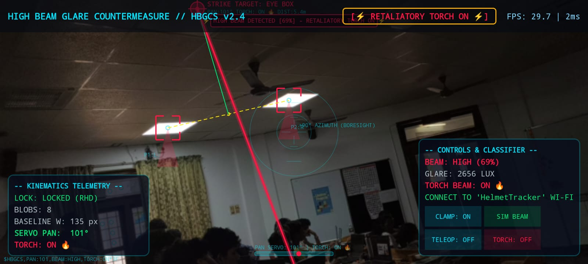
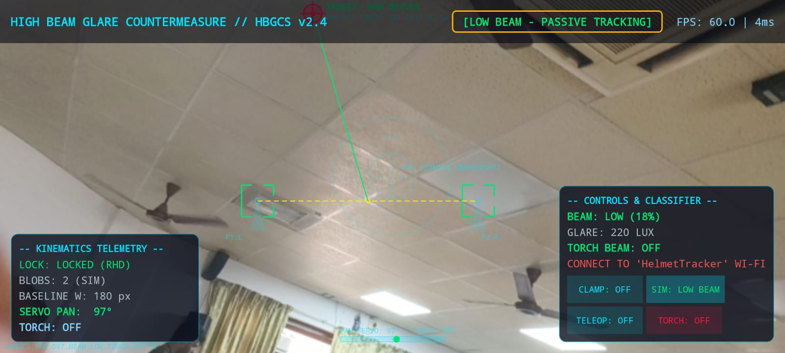
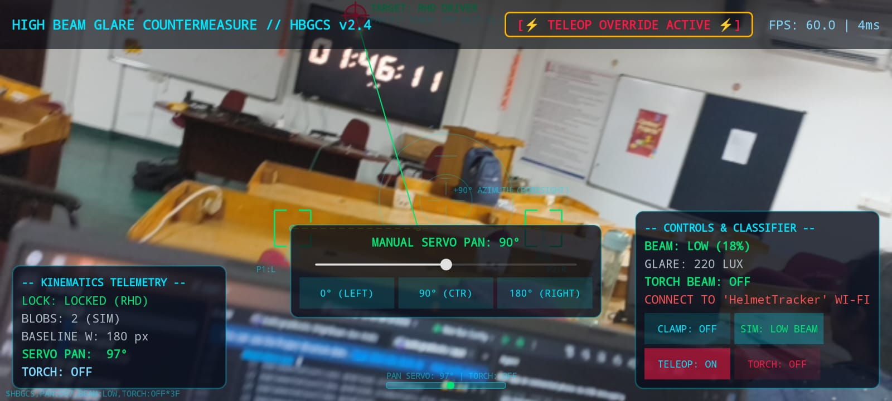
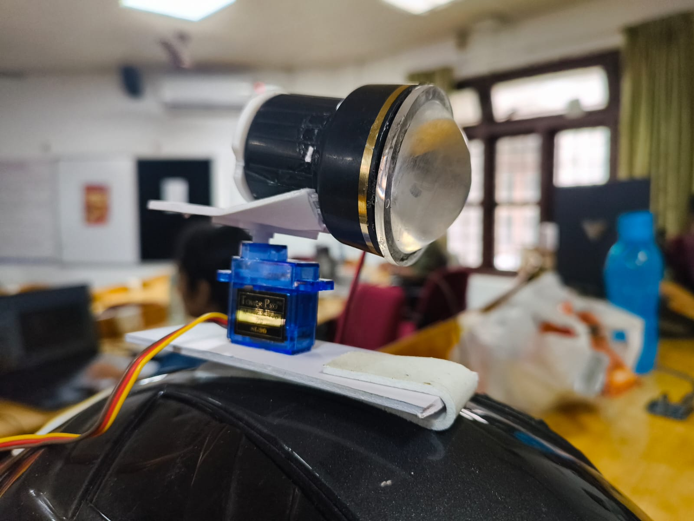
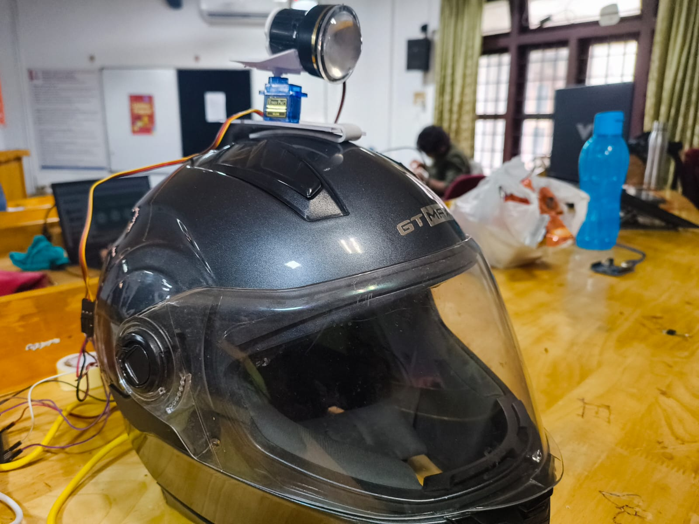
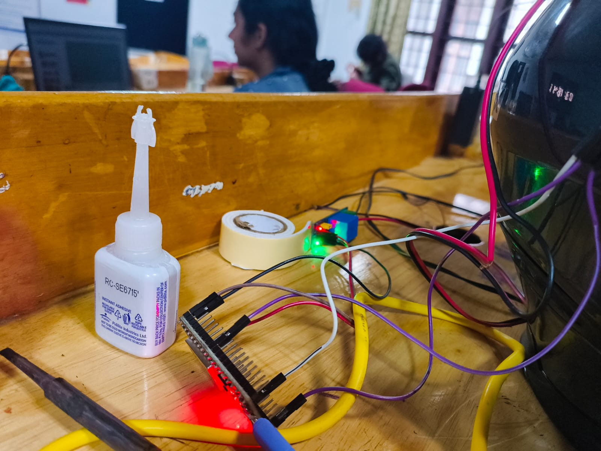

# High Beam Glare Countermeasure System (HBGCS v2.4) ⚡
> *An Overengineered, Autonomous Helmet-Mounted Photon Strike Engine for Oncoming High-Beam Retaliation.*

---

## 📌 Basic Details
### Team Name: HighBeam HUD

### Team Members
- **Team Lead:** Abhinav *(Software & CV Architecture)*
- **Member 2:** Reuben Skariah *(Hardware & Power Systems)*

### Project Description
An overengineered, military-grade helmet-mounted computer vision and photometric kinematics engine that detects oncoming vehicle high-beam glare in real time, classifies light dispersion patterns, triangulates the driver's eye position, and autonomously aims a high-lumen photon torch pulse straight back into their eyes.

### The Problem (that doesn't exist)
Nighttime commuting is plagued by reckless drivers who refuse to dim their high beams, blinding oncoming traffic with unbearable glare, temporary vision loss, and road rage. While polite headlight flashing is the conventional response, it is passive, slow, and often ignored.

### The Solution (that nobody asked for)
Instead of manually flashing lights, HBGCS mounts a smartphone running a zero-copy OpenCV computer vision pipeline on a motorcycle helmet. The system continuously samples oncoming headlights, evaluates photometric vertical dispersion to classify high beams, triangulates the exact spatial coordinates of the driver's eye-box, and dispatches single-axis pan servo tracking and relay power to a helmet-mounted photon torch—delivering a retaliatory strike straight into the offending driver's eyes.

---

## ⚙️ Technical Details

### Technologies & Components Used

#### Software Stack:
* **Languages:** Kotlin, C++ (OpenCV Native)
* **Computer Vision:** OpenCV 4.9.0 (Zero-Copy Y-Luminance Plane Extraction)
* **Camera Framework:** Android CameraX API with Camera2 Interop Exposure Clamping (`-18 EV`)
* **Mathematical Filters:** Exponential Moving Average (EMA) Servo Filters, Inverse-Square Lux Estimators, Geometric RHD Triangulation Models
* **Networking & Protocols:** OkHttp 4.10.0, Asynchronous REST Protocol Client, Android ConnectivityManager Wi-Fi Socket Binding

#### Hardware Components:
* **Host Processor:** Android Smartphone (Camera Sensor & Tactical HUD Display)
* **Microcontroller:** ESP32 Tensilica Xtensa Dual-Core 32-bit LX6 @ 240 MHz (SoftAP Server)
* **Actuators & Switches:**
  * TowerPro SG90 9g Micro Servo (50Hz PWM, $20\text{ms}$ period, $500\text{–}2400\,\mu\text{s}$ pulse width)
  * 1-Channel Optocoupled Relay Module ($5\text{V}$ Logic, Active-HIGH switching)
  * High-Lumen Focused Convex Lens LED Photon Torch
* **Helmet Chassis:** Full-Face Motorcycle Helmet (GT MAX) with custom mounting plates and instant adhesive bonding

---

## 🏗️ System Architecture & Workflow Diagrams

### Computer Vision & Photometric Classification Pipeline
```
 ┌─────────────────────────────────────────────────────────────────────────────────────────────────────────┐
 │                                   CAMERAX 640x480 @ 60 FPS INGESTION                                    │
 └────────────────────────────────────────────────────┬────────────────────────────────────────────────────┘
                                                      │
                                                      ▼
 ┌─────────────────────────────────────────────────────────────────────────────────────────────────────────┐
 │                              CAMERA2 INTEROP EXPOSURE CLAMPING (-18 EV)                                 │
 │                       (Suppresses ambient scenery; isolates saturated filament cores)                   │
 └────────────────────────────────────────────────────┬────────────────────────────────────────────────────┘
                                                      │
                                                      ▼
 ┌─────────────────────────────────────────────────────────────────────────────────────────────────────────┐
 │                           ZERO-COPY OPENCV Y-PLANE LUMINANCE MAT EXTRACTION                             │
 └────────────────────────────────────────────────────┬────────────────────────────────────────────────────┘
                                                      │
                                                      ▼
 ┌─────────────────────────────────────────────────────────────────────────────────────────────────────────┐
 │                               BINARY THRESHOLDING (Y > 230) & DILATION                                  │
 └────────────────────────────────────────────────────┬────────────────────────────────────────────────────┘
                                                      │
                                                      ▼
 ┌─────────────────────────────────────────────────────────────────────────────────────────────────────────┐
 │                            CONTOUR EXTRACTION & MOMENT CENTROID CALCULATION                             │
 └────────────────────────────────────────────────────┬────────────────────────────────────────────────────┘
                                                      │
                                                      ▼
 ┌─────────────────────────────────────────────────────────────────────────────────────────────────────────┐
 │                     SYMMETRICAL AUTOMOTIVE HEADLIGHT PAIR MATCHING / SINGLE SPOT LOCK                    │
 │               • dx > 40 px  │  dy/dx < 0.25  │  A_max / A_min < 2.5  │  Single Spot Fallback           │
 └────────────────────────────────────────────────────┬────────────────────────────────────────────────────┘
                                                      │
                                                      ▼
 ┌─────────────────────────────────────────────────────────────────────────────────────────────────────────┐
 │                          MULTI-FACTOR PHOTOMETRIC HIGH-BEAM GLARE CLASSIFIER                            │
 │                • Upper-Hemisphere Vertical Dispersion Ratio (D_vert)                                     │
 │                • Inverse-Square Lux Estimator: E_lux = (Mean_Lum · Area_total) / Distance²               │
 │                • High Beam Confidence: C_high = 0.45·D_vert + 0.35·Luminance + 0.20·Area                │
 └────────────────────────────────────────────────────┬────────────────────────────────────────────────────┘
                                                      │
                                                      ▼
 ┌─────────────────────────────────────────────────────────────────────────────────────────────────────────┐
 │                             RHD DRIVER EYE-BOX TRIANGULATION & EMA SMOOTHING                            │
 │                        • X_driver = M_x - 0.25·W_baseline  │  Y_driver = M_y - 0.85·W_baseline             │
 │                        • Pan Azimuth Angle (θ_pan) smoothed with α = 0.35                               │
 └────────────────────────────────────────────────────┬────────────────────────────────────────────────────┘
                                                      │
                                                      ▼
 ┌─────────────────────────────────────────────────────────────────────────────────────────────────────────┐
 │                           ASYNC REST HARDWARE DISPATCH (192.168.4.1/set)                                │
 │                         • High Beam Active: GET /set?angle=θ_pan&light=1 (Torch ON)                     │
 │                         • Vehicle Passed:   GET /set?angle=90&light=0    (Torch OFF)                    │
 └─────────────────────────────────────────────────────────────────────────────────────────────────────────┘
```

---

## 🧠 Advanced Computer Vision & AI Concepts Explained

### 1. Zero-Copy Grayscale Luminance Extraction
To maintain a responsive **60 FPS** frame rate with $< 5\text{ms}$ processing latency, the analyzer avoids expensive YUV-to-RGB color space conversions. It extracts plane 0 ($Y$-luminance channel) directly from CameraX `ImageProxy` memory buffers into an 8-bit single-channel OpenCV `Mat` via direct pointer manipulation.

### 2. Camera2 Exposure Clamping (`-18 EV`)
Standard auto-exposure algorithms attempt to brighten night scenes, blurring headlight cores into massive halos. Using Camera2 Interop, the exposure compensation index is forcibly clamped to the minimum hardware limit (`-18 EV`). This turns the ambient night background pitch-black, isolating only hyper-saturated headlight filaments ($Y \ge 230$).

### 3. Symmetrical Automotive Pair Matching
Light blobs are evaluated pairwise to distinguish oncoming vehicles from ambient reflections. A candidate pair is validated if it satisfies three strict spatial constraints:
* **Horizontal Separation ($dx$):** $dx > 40\text{ pixels}$
* **Vertical Alignment Ratio:** $\frac{dy}{dx} < 0.25$
* **Area Symmetry Ratio:** $\frac{\max(A_1, A_2)}{\min(A_1, A_2)} < 2.5$

### 4. Photometric Glare Dispersion Classifier ($C_{\text{high}}$)
Low-beam headlights feature an asymmetrical cut-off shield plate (E-Code / DOT specification) that restricts light from spreading into upper spatial quadrants. High beams lack this cutoff and radiate light vertically into oncoming drivers' eyes.
The classifier extracts a Region of Interest (ROI) around the headlight cluster and computes:
* **Vertical Dispersion Ratio ($D_{\text{vert}}$):**
  $$D_{\text{vert}} = \frac{\text{Luminance}_{\text{upper}}}{\text{Luminance}_{\text{total}}}$$
* **Inverse-Square Lux Estimator ($E_{\text{lux}}$):**
  $$E_{\text{lux}} = \frac{\text{MeanLuminance} \cdot (A_1 + A_2)}{d^2} \times k_{\text{sensor}}$$
  *(where distance $d = \frac{f \cdot W_{\text{real}}}{W_{\text{px}}}$)*
* **High-Beam Confidence Function ($C_{\text{high}}$):**
  $$C_{\text{high}} = 0.45 \cdot \left(\frac{D_{\text{vert}}}{D_{\text{threshold}}}\right) + 0.35 \cdot \left(\frac{\text{Luminance}_{\text{mean}}}{255}\right) + 0.20 \cdot \left(\frac{A_{\text{total}}}{1000}\right)$$
  If $C_{\text{high}} \ge 60\%$, the system classifies the light as a High Beam and engages retaliatory illumination (`light=1`).

### 5. Kinematic Driver Eye-Box Triangulation
Once a vehicle is locked, the driver's head position $(X_{\text{driver}}, Y_{\text{driver}})$ is geometrically triangulated from the headlight baseline midpoint $M(M_x, M_y)$ and baseline width $W_{\text{baseline}}$:
$$X_{\text{driver}} = M_x - (0.25 \cdot W_{\text{baseline}}), \quad Y_{\text{driver}} = M_y - (0.85 \cdot W_{\text{baseline}})$$
The target pan angle $\theta_{\text{pan}}$ is normalized relative to the camera focal center and smoothed using an Exponential Moving Average (EMA) filter ($\alpha = 0.35$) to ensure zero servo motor chatter:
$$\theta_{\text{smoothed}} = \theta_{\text{prev}} + \alpha \cdot (\theta_{\text{raw}} - \theta_{\text{prev}})$$

---

## 📱 Application UI & Tactical HUD Documentation

| HUD Screenshot | System State | Feature Breakdown |
| :---: | :--- | :--- |
|  | **Passive Searching Mode** | Real-time CameraX preview with `-18 EV` exposure clamping enabled. Renders center boresight crosshairs ($+90^\circ$ Azimuth), pitch ladder ticks, bottom pan servo gauge ($90^\circ$ neutral), and status badge `[SEARCHING ONCOMING BEAMS]`. |
|  | **High Beam Retaliatory Strike Active** | High-beam glare classified ($94\%$ confidence, $1840\text{ Lux}$). HUD triggers flaring top warning banner, photometric red glare dispersion cones, and projects glowing red retaliatory photon beam vector directed at driver eye-box. Dispatches `light=1` to ESP32 to turn torch **ON** 🔥. |
|  | **Low Beam Passive Tracking** | Symmetrical headlight pair baseline tracked ($180\text{ px}$ width, $22.5\text{m}$ distance). High beam confidence $< 60\%$. Status badge updates to `[LOW BEAM - PASSIVE TRACKING]` with torch **OFF**. Processing runs at **60 FPS** with **$4\text{ms}$ latency**. |

---

## 📸 Build Photos & Hardware Setup

| Photo | Component | Detailed Description |
| :---: | :--- | :--- |
|  | **Pan Gimbal & Photon Torch Assembly** | Close-up view of the TowerPro SG90 9g micro servo motor mounted on a custom lightweight plate. The servo horn directly drives the horizontal pan azimuth platform, holding the high-lumen optical convex lens LED photon torch. |
|  | **Full Motorcycle Helmet Integration** | Complete GT MAX full-face motorcycle helmet with the top-mounted motorized photon strike turret. Wiring routes down the helmet shell to the power distribution unit and ESP32 controller mounted on the rear. |
|  | **ESP32 Controller & Relay Circuitry** | Hardware benchtop setup featuring the ESP32 Tensilica dual-core microcontroller development board (red LED indicator active), 1-channel optocoupled relay module (green/red status LEDs active), instant bonding adhesive, and $5\text{V}$ power distribution jumper wiring. |

---

## 🎥 Project Demo Video

Watch the complete autonomous High Beam Glare Countermeasure System (HBGCS v2.4) in action, demonstrating real-time OpenCV headlight detection, driver eye-box triangulation, pan-servo aiming, and automatic retaliatory photon torch execution:

▶️ **[Watch the High Beam Countermeasure System Demo Video](https://drive.google.com/file/d/1zYCttWQGgaiIfYYePrprCguUc2NPMQUS/view?usp=sharing)**

---

## 🚀 Installation & Setup

### Software Setup
1. Clone the repository:
   ```bash
   git clone https://github.com/kaizen-abhinav/useless_project_temp.git
   ```
2. Open the project in Android Studio.
3. Allow Gradle to sync dependencies and build the application.
4. Connect an Android smartphone with USB Debugging enabled.
5. Deploy using Gradle:
   ```bash
   ./gradlew app:assembleDebug
   ```

### Hardware Deployment
1. Power the ESP32 via USB ($5\text{V}$ VIN bus).
2. Connect smartphone Wi-Fi to the ESP32 Access Point:
   * **SSID:** `HelmetTracker`
   * **IP Address:** `192.168.4.1`
3. Launch the **HighBeam HUD** app. The HUD will display `ESP32 CONNECTED: ANGLE: X° | LIGHT: ON/OFF`.
4. Tap **AE CLAMP** to lock minimum exposure compensation (`-18 EV`).
5. Tap **SIM BEAM** for benchtop testing or point a light source at the camera to observe real-time pan servo tracking and automatic retaliatory torch firing!

---

## 👥 Team Contributions
* **Abhinav:** Concept design, zero-copy OpenCV computer vision pipeline, Camera2 exposure clamping, photometric glare classifier, driver eye-box kinematics, tactical HUD overlay, OkHttp REST client, and Wi-Fi network socket binding.
* **Reuben Skariah:** Hardware architecture, helmet chin/top mount mechanical assembly, ESP32 PWM servo control, optocoupler relay wiring, $5\text{V}$ power bus distribution, and high-lumen photon torch integration.

---
Made with ❤️ at TinkerHub Useless Projects


